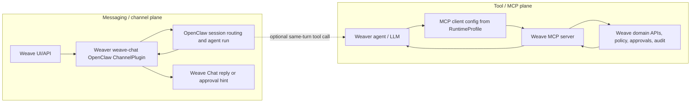

# Weave integration boundary

This repository is the Weaver runtime repository. It is an OpenClaw-derived AI harness/runtime that consumes Weave policy; it is not the Weave product suite and it is not the source of truth for Weave domains, providers, approvals, or audit semantics.

## Weaver owns

- RuntimeProfile loading and validation: signature, hash, profile version, expiry, revocation, rollback, and reload/restart decisions.
- Rendering generated OpenClaw runtime config from the signed Weave `WeaverRuntimeProfile`.
- Member-mode lockdown: raw OpenClaw setup, dashboard/config editing, plugin/channel/MCP/secret/tool allowlist editing, and unsafe local overrides are denied unless the signed profile grants a narrow operator support path.
- The `weave-chat` channel plugin and its Weave Chat runtime API calls to the Weave chat/API target.
- Runtime-side enforcement that tool, MCP, model, channel, reload, revocation, and rollback decisions are audited with support-safe refs.
- Runtime-side application of profile-scoped user customization and tool-use approval constraints; policy meaning and approval semantics still come from Weave.

## Weave owns

- Product semantics: canonical domains, member UX vocabulary, provider-neutral collaboration meaning, and admin/control-room posture.
- Provider/adapter selection, posture, caveats, migration/replacement paths, and readiness evidence.
- MCP/domain-tool action semantics, risk, ApprovalReceipt policy, audit/evidence payload boundaries, and support-safe tool payload rules.
- CredentialRef/SecretRef brokering and signed RuntimeProfile generation.
- The Weave MCP/domain-tool server that Weaver calls, starting with canonical-domain tools such as calendar and files.
- Product/API target for the Weave chat channel.

## Two-plane runtime boundary

Screen-reader description: user messages enter Weaver through the `weave-chat` OpenClaw channel plugin, are routed into an OpenClaw session/agent run, and return through Weave Chat as replies or approval hints. MCP calls start inside the already-running Weaver agent, use RuntimeProfile MCP client bindings, call the Weave MCP server, and receive tool results from Weave domain APIs. These planes can both appear in one turn, but MCP `chat.send_message` is not the user-to-agent channel.

OpenClaw keeps this split explicit: channel plugins own config, security, pairing, session grammar, outbound delivery, threading, and approval capability presentation; core owns the shared `message` tool and dispatch; plugin registration distinguishes `api.registerChannel(...)` from `api.registerTool(...)`; MCP server definitions and ACP/plugin-tool MCP bridges are tool-server bindings, not channel transport.

## `weave-chat` placement

`weave-chat` is implemented here because it is a channel plugin inside the OpenClaw-derived runtime. The product contract for that channel belongs to Weave; the plugin enforcement belongs to Weaver.

Normal member-mode `channels.weave-chat` config may contain Weave API URL, `runtimeProfileHash`, profile version, user runtime id, webhook/event-stream paths, and runtime-token `CredentialRef` handles. It must not contain Matrix, Slack, Teams, Telegram, iMessage, Nextcloud Talk, or other provider-native channel setup. Those providers are Weave backend `providerRef` values and may appear only in support-safe audit metadata approved by the signed profile.

## Review rule

Before merging a Weaver change that mentions Weave, ask: “Am I enforcing a generated runtime/profile/channel/tool boundary, or am I inventing Weave product policy?” If it is product policy, move it to `masssi164/weave` and consume it here only through signed RuntimeProfile or MCP/domain-tool contracts.

## Boundary review checklist

- If the change registers or handles `weave-chat`, it belongs in Weaver and must stay channel-only.
- If the change defines domain-tool names, MCP discovery/invoke behavior, ApprovalReceipt policy, CredentialRefs, or audit meaning, it belongs in Weave and is consumed here through RuntimeProfile/MCP bindings.
- If one agent turn uses both paths, logs and evidence must still distinguish channel message ids/turn ids from MCP tool/action ids.
- MCP `chat.send_message` is never accepted as the inbound user-to-agent channel.
